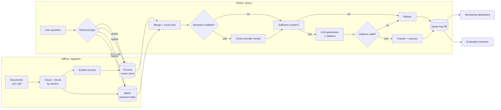

# Enterprise RAG Assistant

A Retrieval-Augmented Generation system for answering questions over enterprise documents — built end-to-end with retrieval, generation, grounding, evaluation, and monitoring, rather than just a chatbot wrapped around an LLM call.

The goal of this project was to practice the parts of RAG that are usually skipped in tutorials: hybrid retrieval, reranking, citation validation, refusal behavior, an offline evaluation harness for comparing retrieval strategies, and a monitoring layer over real query logs.

> **Status:** personal/portfolio project. It runs against a synthetic enterprise document set and a single-user local setup — see [Limitations](#limitations--known-gaps) for what is intentionally out of scope.

## Highlights

- **Configurable retrieval** — vector-only, keyword-only (BM25), or hybrid (weighted score fusion), selectable per request via config.
- **Optional reranking** — a local cross-encoder (`sentence-transformers`) re-scores the retrieved chunks before generation.
- **Grounded generation with refusal** — the LLM is prompted to answer only from retrieved context and cite `[Source N]` per claim; the pipeline independently validates those citations and refuses (rather than hallucinates) when context is weak or citations don't check out.
- **Offline evaluation harness** — retrieval metrics (Recall@K, Precision@K, MRR) and answer metrics (citation accuracy, refusal accuracy, answer correctness) computed against a hand-labeled question set, with an experiment runner that sweeps multiple retrieval configs and produces a comparison table.
- **Monitoring** — every query is logged to a database (question, answer, sources, latency, cost, confidence, refusal reason) and surfaced on a Streamlit dashboard.
- **Provider abstraction** — LLM and embedding backends are behind small interfaces so a provider can be swapped via config instead of code changes.

## Architecture



**Request flow:** question → retrieve (vector / keyword / hybrid) → optional rerank → context-sufficiency check → LLM answer with inline citations → citation validation → response, with every step logged. A response is one of three shapes: a grounded, cited answer; a refusal for insufficient context; or a refusal for invalid/missing citations — the API never returns an uncited or unverifiable claim.

## Tech Stack

| Layer | Choice |
|---|---|
| API | FastAPI + Uvicorn |
| UI | Streamlit (multi-page: Chat, Evaluation, Monitoring) |
| Vector store | ChromaDB (persistent, local) |
| Keyword search | BM25 (`rank-bm25`) |
| Reranking | `sentence-transformers` cross-encoder (`ms-marco-MiniLM-L-6-v2`) |
| Embeddings | OpenAI embeddings (`text-embedding-3-small`) via `langchain-openai` |
| Generation | OpenAI (structured output via `responses.parse`) |
| Logging store | SQLAlchemy ORM over SQLite |
| Config | `pydantic-settings` (env vars) + YAML experiment configs |
| Tests | pytest |

The provider layer (`app/rag/providers.py`, `app/rag/embeddings.py`, `app/rag/vector_store.py`) is written as an interface + factory (`get_llm_provider`, `get_vector_store`, etc.) so Anthropic/Gemini/Ollama LLMs, a local embedding model, or Qdrant can be dropped in later without touching the pipeline. Today OpenAI is the only fully wired path; the others are present as stubs — see [Limitations](#limitations--known-gaps).

## Project Structure

```
app/
  api/            FastAPI app + routers (chat, documents, evaluation)
  rag/            Ingestion, chunking, embeddings, vector store, keyword
                   search, retrieval fusion, reranking, generation, grounding
  evaluation/     Retrieval/answer metrics, experiment config + runner
  monitoring/     Query logging, aggregate metrics, dashboard data
  database/       SQLAlchemy models, session, CRUD
  config.py       Settings (env-driven)
  schemas.py      Pydantic models shared across layers
frontend/
  streamlit_app.py     Landing page
  pages/1_Chat.py      Ask questions, see cited answers
  pages/2_Evaluation.py View retrieval/answer eval + experiment comparisons
  pages/3_Monitoring.py Live query logs, latency, cost, refusal rate
configs/          YAML experiment configs (vector_only, keyword_only, hybrid, hybrid_reranker)
data/
  synthetic_documents/  10 synthetic policy/handbook docs used as the corpus
  eval_questions.json   Hand-labeled question set (expected sources/answers)
  results/               Evaluation + experiment output (JSON/CSV/MD)
scripts/          CLI entry points for indexing, evaluation, experiments
notebooks/        Exploratory analysis (documents, retrieval, evaluation)
tests/            ~40 unit tests across chunking, retrieval, grounding,
                  reranking, pipeline, API, database, monitoring, evaluation
docker/           Dockerfile + docker-compose (api, frontend, qdrant)
```

## Evaluation Results

Numbers from `data/results/experiment_summary.md`, generated by `scripts/run_experiments.py` across the four configs in `configs/`, evaluated against the 20-question labeled set in `data/eval_questions.json`:

| Experiment | Retrieval | Reranker | Recall@5 | Reciprocal Rank | Citation Acc. | Refusal Acc. | Answer Correctness | Latency |
|---|---|---:|---:|---:|---:|---:|---:|---:|
| vector_only | vector | no | 63.4% | 0.56 | 49.9% | 90.1% | 70.5% | 10.90s |
| keyword_only | keyword | no | 47.9% | 0.36 | 49.8% | 81.7% | 49.6% | 8.39s |
| hybrid | hybrid | no | 54.9% | 0.37 | 54.1% | 87.3% | 64.7% | 8.28s |
| hybrid_reranker | hybrid | yes | 63.4% | **0.60** | 52.2% | **91.5%** | 67.6% | 16.88s |

Takeaways:
- Vector search clearly beats keyword search on this corpus (Recall@5: 63.4% vs 47.9%, Reciprocal Rank: 0.56 vs 0.36) — semantic embeddings generalize better than BM25 term overlap for policy-lookup questions phrased in natural language.
- Naive hybrid fusion isn't a free win: blending vector and keyword scores (0.6/0.4 weights) actually underperforms vector alone on Recall@5 (54.9% vs 63.4%) — a noisier keyword ranking dragged into the merge can bump the one correct source out of the top 5.
- Reranking fixes that: adding a cross-encoder rerank on top of hybrid recovers Recall@5 to 63.4% and gives the best ranking quality and refusal accuracy overall (Reciprocal Rank 0.60, Refusal Acc. 91.5%) — at roughly 2x the latency of the non-reranked runs (16.9s vs ~8.3s).
- These numbers differ meaningfully across configs, which is itself notable: earlier versions of this harness had a bug where the experiment runner never actually applied each YAML config to retrieval/reranking/generation, so all four rows came out bit-identical regardless of config. Fixed by threading the config explicitly through `retrieve()`, `answer_question()`, and `generate_answer()` instead of relying on a single global settings object — see the retrieval/reranker/generation wiring in `app/rag/pipeline.py`.

## Getting Started

### Prerequisites
- Python 3.10+
- An OpenAI API key (used for both embeddings and generation by default)

### Install

```bash
git clone <this-repo>
cd Production_RAG
python -m venv venv
venv\Scripts\activate          # macOS/Linux: source venv/bin/activate
pip install -r requirements.txt
cp .env.example .env           # then fill in OPENAI_API_KEY, OPENAI_MODEL, OPENAI_EMBEDDING_MODEL
```

### Run

```bash
# Terminal 1 — API (also builds the Chroma + BM25 indexes from data/synthetic_documents on first import)
uvicorn app.api.main:app --reload --port 8000

# Terminal 2 — Streamlit UI
streamlit run frontend/streamlit_app.py
```

Then open the Streamlit app and use the **Chat** page to ask a question, **Evaluation** to browse experiment comparisons, and **Monitoring** to see logged queries.

### Run with Docker

```bash
docker-compose up --build
```

This starts the API (`:8000`), the Streamlit frontend (`:8501`), and a Qdrant container (currently unused by default — the app ships with Chroma as the active vector store).

### Local models (optional)

The config supports swapping in Ollama models for embeddings/generation instead of OpenAI (see `configs/local_ollama.yaml`). If exploring that path:
1. Install [Ollama](https://ollama.com)
2. Pull a generation and embedding model, e.g. `ollama pull llama3.1` and `ollama pull jeffh/intfloat-multilingual-e5-small:q8_0`

Note: the Ollama code path in `app/rag/providers.py` is currently a stub — see [Limitations](#limitations--known-gaps).

## Configuration

Runtime behavior is driven by environment variables (`app/config.py`, loaded from `.env`):

| Variable | Purpose |
|---|---|
| `LLM_PROVIDER`, `OPENAI_API_KEY`, `OPENAI_MODEL` | Generation backend |
| `EMBEDDING_PROVIDER`, `OPENAI_EMBEDDING_MODEL` | Embedding backend |
| `VECTOR_DB_PROVIDER` | `chroma` (Qdrant is a config option but not yet implemented) |
| `RETRIEVAL_TYPE` | `vector` \| `keyword` \| `hybrid` |
| `VECTOR_TOP_K`, `KEYWORD_TOP_K`, `HYBRID_TOP_K` | Retrieval depth per mode |
| `VECTOR_WEIGHT`, `KEYWORD_WEIGHT` | Score fusion weights for hybrid retrieval |
| `RETRIEVAL_SCORE` | Minimum top score required to answer instead of refuse |
| `RERANKER_ENABLED`, `RERANKER_TYPE`, `RERANK_TOP_K` | Cross-encoder reranking |

For offline evaluation, `configs/*.yaml` capture a full retrieval+reranker+generation configuration per experiment (e.g. `configs/hybrid_reranker.yaml`), so runs are reproducible and comparable independent of whatever is currently in `.env`.

## API Reference

| Endpoint | Method | Description |
|---|---|---|
| `/health` | GET | Liveness check |
| `/chat/` | POST | `{"question": "..."}` → cited answer, sources, confidence, latency, refusal info |
| `/documents/ingest` | POST | Upload a document for ingestion |
| `/evaluation/run` | POST | Run the retrieval evaluation suite |

## Testing

```bash
pytest
```

~40 tests across chunking, ingestion, embeddings, retrieval, keyword search, reranking, grounding/refusal logic, the end-to-end pipeline, the API, the database layer, monitoring, and the evaluation metrics.

## Limitations & Known Gaps

Documented deliberately, since being explicit about what's a prototype vs. production-ready is the point of this section:

- **Synthetic corpus** — the 10 documents in `data/synthetic_documents` are generated policy/handbook content, not real enterprise data.
- **No auth or multi-tenancy** — single-user, no access control or per-document permissions.
- **No real Ollama/Anthropic/Gemini support yet** — `OllamaProvider` and the local embedding provider are stubbed (`app/rag/providers.py`, `app/rag/embeddings.py::LocalEmbeddingProvider`); only OpenAI is fully wired end-to-end.
- **Qdrant is not implemented** — `QdrantVectorStore` is a placeholder; Chroma is the only working vector store despite `docker-compose.yml` provisioning a Qdrant container.
- **Indexing is eager, not incremental** — the vector and BM25 indexes are rebuilt from the full document folder on module import (`app/rag/retriever.py`), rather than persisted and updated incrementally; `/documents/ingest` chunks an upload but doesn't index it yet.

## Roadmap

- Real embedding-based access control / document-level permissions
- Incremental ingestion instead of full re-index on startup
- Finish the Ollama/Anthropic provider implementations for a fully local or multi-provider setup
- A smarter hybrid fusion strategy (the current fixed 0.6/0.4 score blend can underperform vector-only retrieval alone, per the evaluation results above)
- Wire up Qdrant as a real alternative to Chroma
